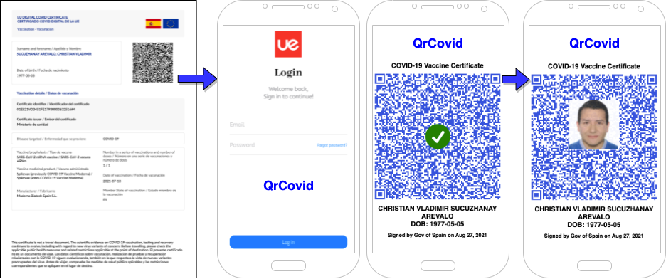

# QR Covid Platform
## Distributed Health Credential Verification & Analytics System

### QR Certificate Processing, Photo Embedding & Vaccination Dashboard

**Academic Engineering Project · Technical & Academic Direction · Distributed Systems / Cloud / Data**


A collaborative final project for **Programación Concurrente y Distribuida (Concurrent and Distributed Programming)** at **Universidad Europea**. Student teams connected QR processing, photo embedding, cloud persistence and analytical views in a Python application under the academic and technical direction of **Christian Vladimir Sucuzhanay Arévalo**.

[Overview](#overview) · [Architecture](#system-architecture--data-flow) · [Stack](#technology-stack) · [Team](#academic-collaboration--team-structure) · [Getting Started](#getting-started)

---

## Overview

QrCovid explores a university vaccination-dashboard use case through three connected workflows:

- Read a QR payload from an image or camera and decode HC1 vaccination data.
- Generate a QR image with a photograph overlaid at its centre.
- Store records and generated images in Firebase, then display vaccination summaries in Streamlit.

The repository preserves an academic prototype and its development experiments. **HC1 prefix checks and payload decoding do not establish certificate authenticity.** The inspected Python flow does not verify cryptographic signatures or certificate trust, and photo embedding does not establish a person's identity.

## System Architecture / Data Flow

```text
                    Streamlit UI · prueba.py
                         │           │
                  Firebase Auth      │
                                     ▼
Image / camera ──► QR reading · crearQr.py
                         │
                    HC1 payload
                         │
              ┌──────────┴─────────────┐
              ▼                        ▼
    Photo overlay + QR image    Base45 → zlib → CBOR
         crearQr.py                hc1_decode.py
              │                        │
              ▼                  ┌─────┴──────────┐
       Firebase Storage          ▼                ▼
       Generated QR images   JSON in Storage   Realtime Database
                                              Usuarios records
                                                   │
                                                   ▼
                                            main.py dashboard
                                            Plotly + Altair
```

This flow follows the calls in [`prueba.py`](prueba.py), [`crearQr.py`](crearQr.py), [`hc1_decode.py`](hc1_decode.py) and [`main.py`](main.py). The camera branch has integration gaps described below.

<details>
<summary>Original academic workflow illustration</summary>



The original `qrcovid.drawio.png` is preserved unchanged in [`assets/qrcovid-workflow.png`](assets/qrcovid-workflow.png). It is a design mockup; its validation symbols and mobile screens are not evidence of verified certificate authenticity or a native mobile application.

</details>

## Core Capabilities

| Capability | Repository evidence |
|---|---|
| QR reading | `crearQr.py` uses OpenCV and pyzbar for saved-image and camera input. |
| Photo embedding | `crearQr.py` generates a QR with high error correction and overlays a photo using Pillow. Readability after embedding is not validated by this documentation update. |
| HC1 decoding | `hc1_decode.py` removes the HC1 prefix, decodes Base45, decompresses with zlib and extracts CBOR vaccination fields. |
| Account access | `prueba.py` contains Firebase email/password registration and sign-in through Pyrebase. |
| Cloud persistence | Generated QR images and decoded JSON are uploaded to Storage; vaccination records are written to Realtime Database. |
| Existing-record checks | `hc1_decode.py` searches stored vaccination identifiers and updates a matching record or inserts one under the user ID. |
| Dashboard | `main.py` contains vaccine-type, dose-completion, elapsed-time and vaccination-month summaries using Plotly, Altair and pandas. |

## Technology Stack

| Layer | Technologies and scope |
|---|---|
| Application | Python · Streamlit |
| Image input and processing | OpenCV · pyzbar · qrcode · Pillow · Tkinter |
| Certificate payload decoding | Base45 · zlib · cbor2 |
| Cloud integration | Pyrebase · Firebase Authentication · Realtime Database · Storage |
| Data and visualization | pandas · Plotly · Altair |
| Exploration | Jupyter notebooks · IPython |
| Historical integration assignment | JavaScript / Node.js / Pathcheck, credited in the original README; no standalone JavaScript implementation or Node.js manifest is present in the current tree. |

## Engineering Scope

The project brings together **application integration, data transformation, cloud services and visualization** within a team-based university assignment. Its distributed-systems context is reflected in the interaction between the local Python application and remote Firebase services.

The repository supports discussion of module boundaries, shared data structures and integration across team responsibilities. It does not establish a dedicated concurrency implementation, measured scalability, production operation or formal security validation. The database sanitization and HC1 endpoint responsibilities below preserve the original team assignments; they are not claims of comprehensive sanitization or a deployed endpoint.

## Academic Collaboration / Team Structure

Credits and group responsibilities are preserved from the original README.

| Contributor | Role | Original responsibility |
|---|---|---|
| **Christian Vladimir Sucuzhanay Arévalo** | Professor · Academic & Technical Director | Course supervision and academic/technical direction |
| **Carlos Moreno** | Group 1 lead | Dashboard data |
| **Camilo Quiroz** | Group 2 lead | Pathcheck / Node.js |
| **Jolie Alain** | Group 3 lead | QR photo embedding / UI / authentication |
| **Maria Rodriguez** | Group 4 lead | Database design / storage / sanitization / existing-user checks |
| **Santiago Barreiro** | Group 5 lead | HC1-to-endpoint integration |

**Student implementation is credited to the collaborating teams.** Christian's role is academic and technical direction, not exclusive authorship of their work.

## Project Structure

```text
.
├── assets/
│   └── qrcovid-workflow.png   # Original academic workflow illustration
├── prueba.py                 # Original documented Streamlit entry point
├── main.py                   # Firebase-backed dashboard functions
├── crearQr.py                # QR reading, generation and photo overlay
├── camara2.py                # Streamlit camera experiment used by the entry point
├── hc1_decode.py             # HC1 decoding and Firebase persistence
├── Hc1_DB.py                 # Earlier database/decoder variant
├── CodigoQRlogo.py           # Standalone QR image-overlay implementation
├── login.py                  # Login development script
├── camara.py                 # Camera development script
├── explorer.py               # File-dialog experiment
├── estado_vacunacion.py      # Vaccination-status development script
├── periodo_vacunacion.py     # Vaccination-period development script
├── vacunas_dosis.py          # Vaccine/dose development script
├── busquedaFoto_QR.ipynb      # QR/photo exploration notebook
├── pedirQrPorCamara.ipynb     # Camera/QR exploration notebook
├── tiempo_medio.png          # Historical dashboard image
├── periodo_vacunacion.png    # Historical dashboard image
├── resultado2.PNG            # Historical result image
└── README.md
```

## Getting Started

**Historical reproduction requires environment and integration work.** No dependency manifest or lockfile is included, and execution was not revalidated for this documentation update.

1. Clone the repository and create an isolated Python environment:

   ```bash
   git clone https://github.com/sukuzhanay/qrcovid-platform.git
   cd qrcovid-platform
   python -m venv .venv
   source .venv/bin/activate
   ```

2. Review the imports in the five files identified by the original README: `prueba.py`, `main.py`, `crearQr.py`, `camara2.py` and `hc1_decode.py`. Keep these files together. In addition to the stack above, their imports include NumPy, Pygments and Requests. Resolve compatible package versions; the code uses legacy APIs such as `Image.ANTIALIAS`. Camera and file-dialog paths require a local graphical environment, Tkinter, a camera and the native library required by pyzbar.

3. Before execution, prepare an isolated Firebase project with Authentication, Realtime Database and Storage, and review the hard-coded configuration in the source. `main.py` attempts sign-in at import time using embedded historical credentials. Do not reuse those credentials or the original backend. The decoder expects `archivos/vacunas.json`, `archivos/Fabricante.json` and `archivos/profilaxis.json` in Storage; these lookup files are not included in the repository. Use synthetic records for reproduction.

4. After resolving configuration, dependencies and the integration gaps below, the original launch command is:

   ```bash
   streamlit run prueba.py
   ```

The UI contains **Entrar/Registrar** (sign-in/registration), **Home** (dashboard) and **Ajustes** (QR workflows).

**Known integration gaps:** `prueba.py` calls `camara2.hacerFotoCara()`, which is not defined in `camara2.py`. Its camera branch also calls `BBDD().decode(hc1)` without the required `localId` argument and expects `fotoCara.png`, while `camara2.py` writes `fotoPersona.png`. These functional issues remain unchanged. The original README identifies the other scripts as development material rather than additional application entry points.

## Legacy / Context Note

QrCovid is a historical educational project about COVID-era QR data and vaccination dashboards. It makes no claim about current certificate acceptance, operational availability, clinical suitability or production readiness. Dashboard calculations describe the prototype's stored records and rules; they are not validated public-health metrics.

The original README referenced [Pathcheck](https://github.pathcheck.org/verify.html#processed) for verification. That historical reference and the group assignment are retained as context; current service availability and integration are not established here.

## Related Work & Professional Identity

This collaborative teaching project illustrates the **Former University Lecturer** dimension of Christian's professional background: guiding student teams across application, cloud and data components.

Explore [eBurnout](https://github.com/sukuzhanay/eburnout) for related historical engineering work and the [technical portfolio](https://sukuzhanay.github.io/) for broader project context. The professional headline below describes Christian's current identity; it does not attribute AWS, generative AI or machine learning capabilities to QrCovid.

---

## Academic & Technical Direction

**Christian Vladimir Sucuzhanay Arévalo**

Data & AI Solutions Architect | AWS Data Architecture | Generative AI & Amazon Bedrock | Big Data | Former University Lecturer

[](https://christiansucuzhanay.com/)
[](https://www.linkedin.com/in/sucuzhanay)
[](https://builder.aws.com/community/@sukuzhanay)
[](https://github.com/sukuzhanay)

[Technical Portfolio](https://sukuzhanay.github.io/)

**Build. Explain. Teach. Share.**
